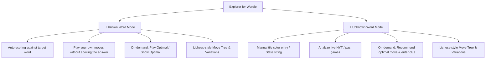

# Explorer for Wordle: Redesigned UI & Mental Model Architecture

## 1. Core Philosophy & Mental Model

The redesigned architecture simplifies the experience into two explicit, intuitive modes:



---

## 2. Detailed Mode Specifications

### 🎯 Mode 1: Known Word Mode (Target Known)
* **Use Case**: Practice, puzzle exploration, solver verification, testing your intuition against a chosen or random target.
* **Target Control**:
  * `Target: [ P I L O T ]` with `[🎲 Random Target]` and `[🔒 Hide / 👁️ Reveal]` toggle (play blind without spoiling).
* **Board & Guessing**:
  * Enter any 5-letter word on the board or virtual keyboard.
  * Tile colors are **automatically computed** against the secret target.
* **Analysis & Feedback on Guess**:
  * Immediate feedback on your played word: **Skill Score** (0–100), **Luck Score** (0–100), and **Candidate Reduction** (`3,209 → 45 words remain`).
  * **Remaining Candidate Words Panel**: View, search, and click any of the remaining matching words.
* **On-Demand Assistance (Zero Unwanted Spoilers)**:
  * **`[🤖 Play Optimal Move]`**: Directly plays the strategy's recommended move for the next turn.
  * **`[💡 Show Optimal Move]`**: Reveals what the bot would have played at this turn in a comparison card (Entropy, Expected Reduction, Bins).
* **Lichess-Style Move Tree**:
  * Move list showing turn history: `1. CRANE 🟨⬛⬛⬛🟩 (45 left)  2. PILOT 🟩🟩🟩🟩🟩 (Solved!)`
  * Click any move in the history to jump back to that game state.
  * Branch alternate moves into sub-lines with `[Promote to Main Line]` and `[Delete Line]`.

---

### ❓ Mode 2: Unknown Word Mode (Target Unknown / Sandbox)
* **Use Case**: Daily NYT Wordle companion, analyzing a friend's game, exploring custom clue states.
* **Board & Guessing**:
  * Type a guess, then click the board tiles to toggle colors (⬛ Gray ➔ 🟨 Yellow ➔ 🟩 Green), or paste a `word.pattern` string.
* **Assistance & Flow**:
  * Click **`[🤖 Recommend Move]`** to get the best next move according to the active strategy.
  * Input the pattern received in your real game.
  * The engine calculates skill, candidate reduction, remaining words, and Top-N rankings identically.

---

## 3. UI Layout & Wireframe

```
+---------------------------------------------------------------------------------------------------------------+
|  [🟩🟨⬛] EXPLORER FOR WORDLE      Mode: [ (●) 🎯 Known Word  |  ( ) ❓ Unknown Word ]       [🌓 Theme] [🔗 Share] |
+---------------------------------------------------------------------------------------------------------------+
|                                                |                                                              |
|  LEFT PANEL: GAMEPLAY & BOARD                  |  RIGHT PANEL: LICHESS-STYLE ANALYSIS STUDIO                  |
|                                                |                                                              |
|  +------------------------------------------+  |  +--------------------------------------------------------+  |
|  | Target: [ P I L O T ]  [🎲] [🔒/👁️]        |  |  ANALYSIS MOVE TREE & VARIATIONS                      |  |
|  +------------------------------------------+  |  |  1. TARSE 🟨⬛⬛⬛⬛ (81 left)  [⭐ Best Move]             |  |
|                                                |  |     └─ 1... CRANE 🟨⬛⬛⬛🟩 (45 left) [Branch] [Promote]   |  |
|  [ 6x5 WORDLE TILES ]                          |  |  2. DONUT ⬛🟨⬛⬛🟩 (3 left)   [⭐ Best Move]             |  |
|  Row 1:  [ T ][ A ][ R ][ S ][ E ] (81 left)   |  |  3. PILOT 🟩🟩🟩🟩🟩 (Solved!)                         |  |
|  Row 2:  [ D ][ O ][ N ][ U ][ T ] (3 left)    |  +--------------------------------------------------------+  |
|  Row 3:  [ P ][ I ][ L ][ O ][ T ] (Solved!)   |                                                              |
|  Row 4..6: Empty                               |  +--------------------------------------------------------+  |
|                                                |  |  TURN METRICS (Turn 1: TARSE)                          |  |
|  +------------------------------------------+  |  |  Skill: 98/100 (Optimal)  •  Luck: 54/100 (Avg)        |  |
|  | [🤖 Play Optimal]   [💡 Show Optimal]    |  |  Pool: 3,209 ➔ 81 words remaining (-97.5%)                |  |
|  | [⎌ Step Back]       [⟲ Reset / New Game] |  |  [💡 Compare with Bot's Choice]                           |  |
|  +------------------------------------------+  |  +--------------------------------------------------------+  |
|                                                |                                                              |
|  [ VIRTUAL KEYBOARD ]                          |  +--------------------------------------------------------+  |
|  Q W E R T Y U I O P                           |  |  TABS: [🎯 Remaining Words (81)] [🏆 Top-N] [📦 Bins]  |  |
|  A S D F G H J K L                             |  |  ----------------------------------------------------  |  |
|  ENTER  Z X C V B N M  ⌫                       |  |  Filter: [ Search words... ]                           |  |
|                                                |  |  [ PILOT ] [ PIVOT ] [ PINOT ] [ PIPIT ] ...           |  |
|                                                |  |  (Click any word to test or play it)                   |  |
|                                                |  +--------------------------------------------------------+  |
+---------------------------------------------------------------------------------------------------------------+
```

---

## 4. Analysis Tree (Lichess-Style) Mechanics

1. **Move History Representation**:
   - Every guess is recorded with its turn index, score emoji string, remaining candidate count, and optimality badge.
2. **Branching / Variations**:
   - If you rewind to Turn 1 (`TARSE`) and type `CRANE`, instead of overwriting history destructively, a variation branch is created:
     - **Main Line**: `1. TARSE → 2. DONUT → 3. PILOT`
     - **Variation A**: `1... CRANE → 2... BLIMP`
   - You can click **[Promote to Main Line]** to make Variation A your primary game line, or click **[Delete]** to remove the branch.
3. **Interactive Step Navigation**:
   - Clicking any move in the tree instantly rewinds the board display and updates the candidate pool and metrics to that exact moment.

---

## 5. Comparison: What Gets Simplified

| Old Scaffolding | New Streamlined Design |
| :--- | :--- |
| **Confusing Tabs & State** | Clear division: Board + Move Tree + Deep-Dive Tabs (Candidates, Top-N, Bins) |
| **Spoiled Optimal Move** | Optimal move hidden by default in Known Word Mode; revealed only when requested via `[💡 Show Optimal]` |
| **Destructive Rewind** | Lichess-style variation tree allows exploring multiple what-if lines simultaneously |
| **Tile Color Ambiguity** | Explicit Mode Toggle: Auto-Score against target vs. Manual Tile Coloring |
| **Candidate Exploration** | Dedicated interactive "Remaining Words" tab with live search and click-to-play chips |

---

## 6. Implementation Plan

1. **Move Tree State Engine (`engine/tree.ts`)**:
   - Implement tree node data structure supporting main line and branch variations, node switching, promotion, and deletion.
2. **Mode-Aware UI Layout (`main.ts` & `style.css`)**:
   - Create clean header mode toggle (`Known Word` vs `Unknown Word`).
   - Implement the Lichess-style interactive move tree component in the top-right panel.
3. **Dedicated Remaining Candidates Explorer Tab**:
   - Instant search filter over the active pool, with click-to-play buttons.
4. **On-Demand Assistance Toolbar**:
   - `[🤖 Play Optimal Move]` and `[💡 Show / Compare Optimal Move]`.
